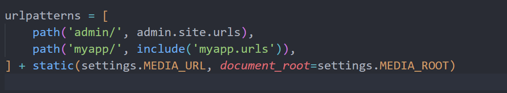
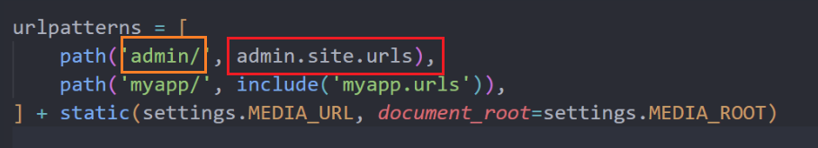
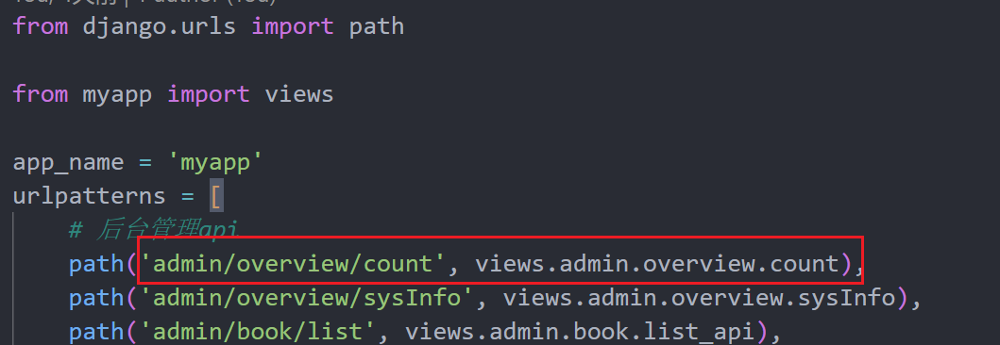

# 后端
bookproject下的urls.py

这段代码是Django框架中的URL配置（URLconf），它定义了项目中URL路径与视图的对应关系。以下是对这段代码的解释：

1. `path('admin/', admin.site.urls)`：
   - 这行代码将URL路径 `admin/` 映射到Django的默认管理站点。
   - 访问 `http://<your-domain>/admin/` 会进入Django自带的管理后台。

2. `path('myapp/', include('myapp.urls'))`：
   - 这行代码将URL路径 `myapp/` 映射到 `myapp` 应用中的URL配置文件 `myapp.urls`。
   - 访问 `http://<your-domain>/myapp/` 会根据 `myapp/urls.py` 文件中的配置继续进行URL匹配。

3. `+ static(settings.MEDIA_URL, document_root=settings.MEDIA_ROOT)`：
   - 这行代码是用来服务媒体文件的（如上传的图片、文件等）。
   - `settings.MEDIA_URL` 定义了媒体文件的URL前缀，`settings.MEDIA_ROOT` 定义了媒体文件的存储路径。
   - 这样配置后，可以通过指定的URL访问存储在 `MEDIA_ROOT` 目录中的媒体文件。
   - 

进入橙框路径后，会执行红框中的函数

eg：
以myapp/urls.py为例，在urls.py中定义的urlpatterns列表中，有一条如下的url：

进入该路径后，执行


```python
def count(request):
    if request.method == 'GET':
        now = datetime.datetime.now()
        book_count = Book.objects.all().count()
        # print(utils.get_monday())
        book_week_count = Book.objects.filter(create_time__gte=utils.get_monday()).count()
        borrow_count = Borrow.objects.filter(status='1').count()
        return_count = Borrow.objects.filter(status='2').count()
        overdue_count = Borrow.objects.filter(expect_time__lt=now).count()
```
获取当前时间。
计算书籍总数。
计算本周新增书籍数（使用一个 utils.get_monday() 工具函数来获取本周一的日期）。
统计当前借书、还书和逾期的数量。
```python
        # 借书人数(sql语句)
        borrow_person_count = 0
        sql_str = "select user_id from b_borrow where status='1' group by user_id;"
        with connection.cursor() as cursor:
            cursor.execute(sql_str)//执行sql语句
            sql_data = dict_fetchall(cursor)//返回一个字典列表
            borrow_person_count = len(sql_data)

        # 还书人数(sql语句)
        return_person_count = 0
        sql_str = "select user_id from b_borrow where status='2' group by user_id;"
        with connection.cursor() as cursor:
            cursor.execute(sql_str)
            sql_data = dict_fetchall(cursor)
            return_person_count = len(sql_data)

        # 逾期人数(sql语句)
        overdue_person_count = 0
        now = datetime.datetime.now().strftime('%Y-%m-%d %H:%M:%S.%f')
        sql_str = "select user_id from b_borrow where expect_time < '" + now + "' and status='1' group by user_id;"
        with connection.cursor() as cursor:
            cursor.execute(sql_str)
            sql_data = dict_fetchall(cursor)
            overdue_person_count = len(sql_data)

        # 统计借阅排名(sql语句)
        sql_str = "select A.book_id, B.title, count(A.book_id) as count from b_borrow A join b_book B on " \
                  "A.book_id=B.id group by A.book_id order by count desc; "
        with connection.cursor() as cursor:
            cursor.execute(sql_str)
            borrow_rank_data = dict_fetchall(cursor)

        # 统计分类比例(sql语句)
        sql_str = "select B.title, count(B.title) as count from b_book A join b_classification B on " \
                  "A.classification_id = B.id group by B.title order by count desc limit 5; "
        with connection.cursor() as cursor:
            cursor.execute(sql_str)
            classification_rank_data = dict_fetchall(cursor)

        # 统计最近一周访问量(sql语句)
        visit_data = []
        week_days = utils.getWeekDays()
        for day in week_days:
            sql_str = "select re_ip, count(re_ip) as count from b_op_log where re_time like '" + day + "%' group by re_ip"
            with connection.cursor() as cursor:
                cursor.execute(sql_str)
                ip_data = dict_fetchall(cursor)
                uv = len(ip_data)
                pv = 0
                for item in ip_data:
                    pv = pv + item['count']
                visit_data.append({
                    "day": day,
                    "uv": uv + random.randint(1, 20),
                    "pv": pv + random.randint(20, 100)
                })
```
以上通过sql语句统计了借阅排名、分类比例、最近一周访问量。
```python
        data = {
            'book_count': book_count,
            'book_week_count': book_week_count,
            'borrow_count': borrow_count,
            'borrow_person_count': borrow_person_count,
            'return_count': return_count,
            'return_person_count': return_person_count,
            'overdue_count': overdue_count,
            'overdue_person_count': overdue_person_count,
            'borrow_rank_data': borrow_rank_data,
            'classification_rank_data': classification_rank_data,
            'visit_data': visit_data
        }
        return APIResponse(code=0, msg='查询成功', data=data)
```
将所有统计结果打包成字典并返回一个API响应
==GET请求一般用来显示页面，POST请求一般用来返回数据，需要对函数进行请求判断==
POST请求需要处理跨域访问问题，在settings.py中配置(一般框架不涉及这个问题，django多加了一个验证导致的)
# 前端